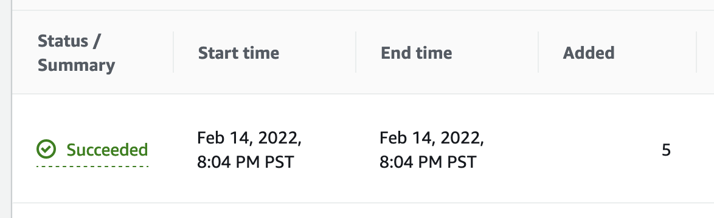

# Amazon Kendra - Parsing JSON content using Amazon Kendra Custom Document Enrichment tool

### What you'll learn in this tutorial:

1. Use Kendra to index your exported content from a CMS or other content source 
2. Use Custom Document Enrichment tool that allows you to create, modify, or delete document attributes and content when you ingest your documents into Amazon Kendra
3. Create Lambda function as a pre-extractor scripts for Document enrichment tool. 
4. Create an Amazon Kendra index, Data source , Document enrichments , Index fields and sync the data
5. Search indexed data to confirm that Document enrichments are present. 

This tutorial takes about 45-60 minutes to complete.

## Concepts

Reference : https://docs.aws.amazon.com/kendra/latest/dg/s3-metadata.html

#### What is Amazon Kendra

Amazon Kendra is a highly accurate and easy to use enterprise search service that’s powered by machine learning. Kendra delivers powerful natural language search capabilities to your websites and applications so your end users can more easily find the information they need within the vast amount of content spread across your company.

#### Customizing document metadata during the ingestion process

Reference : https://docs.aws.amazon.com/kendra/latest/dg/custom-document-enrichment.html 

You can alter your document metadata or attributes and content during the document ingestion process. Amazon Kendra Custom Document Enrichment tool allows you to create, modify, or delete document attributes and content when you ingest your documents into Amazon Kendra. This means you can manipulate and ingest your data on the fly.

This tool gives you control over how your documents should be treated and ingested into Amazon Kendra. For example, you can scrub personally identifiable information in the document metadata while ingesting your documents into Amazon Kendra.

The overall process of Custom Document Enrichment is as follows:

1. You configure Custom Document Enrichment when you create or update your data source, or index your documents directly into Amazon Kendra.
2. Amazon Kendra applies inline configurations or basic logic to alter your data. For more information, see Basic data manipulation.
3. If you choose to configure advanced data manipulation, Amazon Kendra can apply this on your original, raw documents or on the structured, parsed documents. For more information, see Advanced data manipulation.
4. Your altered documents are ingested into Amazon Kendra.

**Note** : At any point in this process, if your configuration is not valid, Amazon Kendra throws an error.

In this tutorial we will be doing advanced data manipulation using Lambda functions. For more details visit [Advanced data manipulation](https://docs.aws.amazon.com/kendra/latest/dg/custom-document-enrichment.html#advanced-data-manipulation)

We will be applying the Lambda function during PreExtraction Hook Configuration. The Lambda function  should expect the following request structure. We will be reading s3Bucket and s3ObjectKey in our tutorial from the temporary bucket where original data is copied for PreExtraction

```
{
    "version": <str>,
    "dataBlobStringEncodedInBase64": <str>, //In the case of a data blob
    "s3Bucket": <str>, //In the case of an S3 bucket
    "s3ObjectKey": <str>, //In the case of an S3 bucket
    "metadata": <Metadata>
}
```
The Lambda function for PreExtraction must adhere to the following response structure

```
{
    "version": <str>,
    "dataBlobStringEncodedInBase64": <str>, //In the case of a data blob
    "s3ObjectKey": <str>, //In the case of an S3 bucket
    "metadataUpdates": [<CustomerDocumentAttribute>]
}
```

The metadata structure, which includes the CustomerDocumentAttribute structure, is as follows

```
{
    "attributes": [<CustomerDocumentAttribute<]
}

CustomerDocumentAttribute
{
    "name": <str>,
    "value": <CustomerDocumentAttributeValue>
}

CustomerDocumentAttributeValue
{
    "stringValue": <str>,
    "integerValue": <int>,
    "longValue": <long>,
    "stringListValue": list<str>,
    "dateValue": <str>
}
```

Example in our tutorial we return the following 

```
    {
        "version" : "v0",
        "s3ObjectKey": s3_document_key,
        "metadataUpdates": [
            {"name":"_document_title", "value":{"stringValue":_document_title}},
            {"name":"_document_id", "value":{"stringValue":_document_id}},
            {"name":"description", "value":{"stringValue":description}},
            {"name":"_source_uri", "value":{"stringValue":_source_uri}},
            {"name":"site_name", "value":{"stringValue":site_name}},
            {"name":"keywords", "value":{"stringValue":keywords}},
            {"name":"image", "value":{"stringValue":image}},
        ]
    }
```

## Background

You may have a situation where there is an existing CMS or content which you would like to export out in JSON and index it in Kendra. You can alter your document metadata or attributes and content during the document ingestion process. Amazon Kendra Custom Document Enrichment tool allows you to create, modify, or delete document attributes and content when you ingest your documents into Amazon Kendra. This means you can manipulate and ingest your data on the fly. 

This tool gives you control over how your documents should be treated and ingested into Amazon Kendra. For example, you can scrub personally identifiable information in the document metadata while ingesting your documents into Amazon Kendra.

In this demo, we will export JSON files from sample webpages with our sample code

* JSON file with all the required fields needed for indexing 

Example

- quarantine-isolation.json --> This will have have all required fields needed for indexing 

Below is an example of what quarantine-isolation.json would contain

```
{
    "documentID": "5",
    "title": "Quarantine & Isolation",
    "description": "Quarantine after possible exposure to COVID-19 and stay home to monitor your health. Isolate when you have been infected with the virus and stay separated from others in your household.",
    "url": "https://www.cdc.gov/coronavirus/2019-ncov/your-health/quarantine-isolation.html",
    "_source_uri": "https://www.cdc.gov/coronavirus/2019-ncov/your-health/quarantine-isolation.html",
    "site_name": "Centers for Disease Control and Prevention",
    "image": "https://www.cdc.gov/coronavirus/2019-ncov/images/your-health/328871-quarantine-and-isolation-guidance-1200x675-1.jpg?_=31337",
    "icon": "/TemplatePackage/4.0/assets/imgs/favicon-32x32.png",
    "keywords": "quarantine, isolation, isolate, COVID-19, exposure, prevent spread, stay home, separate, monitor health, Coronavirus [CoV], Prevention & Infection Control, Distancing"
}

```

## Architecture

We will be implementing below architecture for our demo. 


Step 1 : Export your sample web pages into following file for example

- quarantine-isolation.json --> This will have have all required fields needed for indexing 

Step 2 : Create two S3 buckets, one for keeping the original exported files under 'documents/' folder and one empty S3 bucket for pre-extraction purpose. 

- **First S3 bucket (Source) : documents/** : This will orginal document on which pre-extraction process will happen e.g. *quarantine-isolation.json*
- **First S3 bucket (Pre-Extraction) : Empty with no folders**: 


Step 3 : Do the following in Amazon Kendra 

* Create Lambda function for the pre-extractor
* Create Kendra index. 
* Create Datasource using source S3 bucket. Reference : [Getting started with an Amazon S3 data source (console)](https://docs.aws.amazon.com/kendra/latest/dg/getting-started-s3.html) 
* Use the console or the [UpdateIndex API](https://docs.aws.amazon.com/kendra/latest/dg/API_UpdateIndex.html) to create the index fields. The supported field types are date, long, string, and string list. Reference : [Creating custom document attributes](https://docs.aws.amazon.com/kendra/latest/dg/custom-attributes.html)
* Add document enrichment configurations
* Sync the content

Once all the steps are done and verified, you can search & verify your content. 

## Getting Started

### Step 1

##### Prerequisites

**Note** : *Any latest version of Node.js installed. At the time of writing this tutorial the version of Node is v12.16.1. Ensure its in your classpath. *

1. Create a folder 'KendraMetaData' on your local or [AWS Cloud9](https://aws.amazon.com/cloud9/) and download the 'exportDocumentsKendraMetadata.js' node.js file in it. Run 'npm install' to install the dependancies listed in 'package.json' file. 
2. Within 'KendraMetaData', create two more folders 'data/documents/' and 'data/metadata/'
3. The sample code will do the following 
   - Iterate through each of sample web urls and fetch basic info like 'title', 'description', 'keywords' etc.
   - Create 'fileName.txt' and put 'description' in it for indexing. Programme will store in folder 'data/documents/'
   - Create 'fileName.txt.metadata.json' with custom attributes/metadata about the document. Programme will store in folder 'data/metadata/'
7. Run the sample code by typing and verify the outputs and generated files in the folders

```
node exportDocumentsKendraMetadata.js
```

### Step 2 : Create S3 bucket

Create an S3 bucket in region of your choice. For the tutorial create in us-west-2 region. 

For basics of how to create S3 bucket refer [Creating a bucket](https://docs.aws.amazon.com/AmazonS3/latest/userguide/create-bucket-overview.html)

Once the bucket is created, we will create two folders 

1. data/
2. metadata/
   - data/

For the uploads follow the process:

Upload the generated files from your local folder under *'data/documents/'* to S3 bucket's *data/*


Upload the generated files from your local folder under *'data/metadata/'* to S3 bucket's *metadata/data/*


### Step 3 : Create Kendra Index

Create Kendra Index as shown. Reference : [Creating an Index](https://docs.aws.amazon.com/kendra/latest/dg/create-index.html)

**Note** : Amazon Kendra requires permissions to access your CloudWatch log. Choose an existing IAM role or create a role for you.

After creation, your Index should be in an active state


### Step 4 : Create Kendra S3 Data source

Create a data source using S3 as data source where you have uploaded the files. 

[Getting started with an Amazon S3 data source (console)](https://docs.aws.amazon.com/kendra/latest/dg/getting-started-s3.html) 

While creating the data source, point to the correct data and metadata folders in your S3 bucket created in Step 2 above. 

**Note** : 

1. Amazon Kendra requires permissions for other services (S3 bucket in this case) to create this data source. Choose an existing IAM role or create a role for you.
2. Select On-Demand for run schedule 


After creation, your data source should be in an active state


### Step 5 : Create Facet definition

In order to enable an attribute to be returned in the query result , you need to enable faceting for that specific field on the Facets definition page.

On the Facet definition page in the Amazon Kendra console, you will find 4 options:

* **Facetable**: Indicates that the field can be used to create search facets, a count of results for each value in the field. The default is false .
* **Searchable**: Determines whether the field is used in the search. If the Searchable field is true, you can use relevance tuning to manually tune how Amazon Kendra weights the field in the search. The default is true for string fields and false for number and date fields.
* **Displayable**: Determines whether the field is returned in the query response. The default is true.
* **Sortable**: Determines whether the field can be used to sort the results of a query. If you specify sorting on a field that does not have Sortable set to true, Amazon Kendra returns an exception. The default is false.


Repeat above steps with below fields adding the data type and index usage types. 

| Fields  | Details (Data Type & Index Type) |
| ------------- | ------------- |
| documentID  | String - Searchable, Displayable |
| title  | String - Searchable, Displayable  |
| description  | String - Searchable, Displayable |
| url  | String - Searchable, Displayable  |
| site_name  | String - Facetable, Searchable, Displayable  |
| image  | String - Searchable, Displayable  |
| icon  | String - Searchable, Displayable  |
| keywords  | String - Searchable, Displayable  |

**Note** : Amazon Kendra has 15 reserved fields, which you can map to your document attributes. For more information, please refer [Index](https://docs.aws.amazon.com/kendra/latest/dg/hiw-index.html). One of them we are using in our metadata.json file is *_source_uri* which override defaults and points to the actual sample web page rather than S3 Object path. Since *_source_uri* is a reserved field in Kendra, we don't have to add to add it definition. 


### Step 6 : Sync/Index your Data source. 

With all set up, we will now On-Demand sync our data source in Step 4 above. 

#### Select the data source and click Sync now


#### Once sync starts, it will show an in progress message above. 


#### Once sync completes, you will see a success message as shown below. 


#### You can look into the sync details by click on the data source and going on the details page. You will see total number of documents added. If there are errors, you can inspect the cloudwatch logs. 



### Step 7 : Search indexed content

With our content indexed, lets search indexed content

#### Select Search indexed content


#### Search the content


## Conclusion and Clean Up

In this tutorial we saw how we can use in Kendra the S3-metadata option to apply custom attributes to your documents using metadata files. With this base you can now scale your architecture according to your requirements. 

In these last steps we will clean up our environment we need to delete a few things so we don't end up with unnecessary charges.

1. First step is to remove our Amazon Kendra index.
   - Click on "Services" on the top menu bar and search for Kendra to get to the Amazon Kendra homepage
   - Click "Indexes" on the sidebar menu to get to our list of indexes
   - Check the box next to our index we created in this tutorial
   - Click on Actions, then Delete

2. Next we will delete our S3 bucket
   - Click on "Services" on the top menu bar and search for S3 to get to the S3 homepage
   - Find your S3 bucket created in this tutorial and check the box next to it
   - In the menu near the top click on "Delete"
   - You will be prompted with some information about deleting your bucket. This will delete the bucket and all of its contents. Enter your bucket name here and click "Confirm".

Your index and bucket we used in this tutorial should now be deleted.

